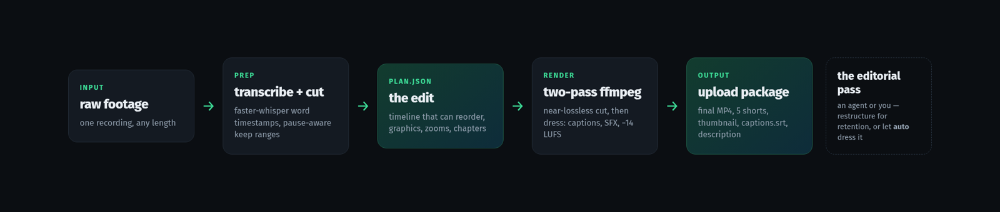
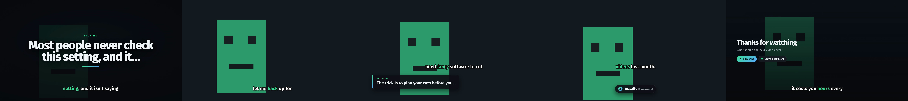
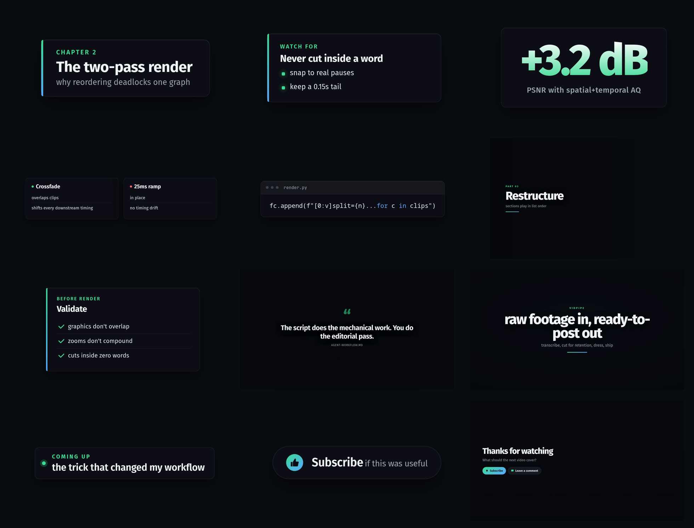

# vidpipe

**Raw footage → finished, ready-to-post video. 100% local.**

One recording in; out comes the edited video, the shorts, the thumbnail, the
captions, the description and the chapter marks. No upload, no account, no
subscription, no cloud — everything runs on your machine through ffmpeg,
faster-whisper and headless chromium.

```
./run.sh auto ~/footage/talk.mp4 talking
```



## What you get

`run.sh auto` cuts the dead air and dresses the video deterministically; the
result lands in `<footage>.vidpipe/result/`:

| file | what it is |
|---|---|
| `final.mp4` | the cut, dressed: captions burned in, graphics, SFX, −14 LUFS mix |
| `shorts/` | vertical 1080×1920 shorts, scored, cropped to the subject, hook card + captions |
| `thumbnail.png` | real frame from the hook moment + hook text, 1280×720 |
| `captions.srt` | soft captions for the upload (the burned-ins stay in the MP4) |
| `description.txt` `titles.txt` `chapters.txt` | the upload metadata, derived from the transcript |



## Why local

Editing footage means sending hours of your raw video somewhere. vidpipe
doesn't: the transcription runs on your GPU (or CPU), the graphics render in a
local chromium, the encode is your ffmpeg — with NVENC when you have it and
libx264 when you don't. Nothing leaves the machine. There is nothing to sign up
for, and the whole thing is ~1,800 lines you can read in an afternoon.

## How it works

1. **prep** — faster-whisper (word-level timestamps) → keep every moment with
   speech, or loud action without commentary (gameplay mode); drop isolated
   fillers; snap every cut to a word boundary with a breath left at the seam.
2. **plan.json** — the edit as data: `timeline` sections that play in list
   order and may jump backwards in the source (that's what makes cold opens and
   restructuring possible), plus graphics, zooms, chapters and SFX events.
3. **the editorial pass** — restructure for retention: cold open, cut the
   rambles, reorder where references survive, write the cards. Do it yourself
   or hand `docs/AGENT-WORKFLOW.md` to an agent — it's the judgement checklist
   this pipeline was built around. Or skip it: `auto` dresses with
   conservative, verbatim-from-the-transcript graphics instead.
4. **render** — two ffmpeg passes. Reordering can't be one graph (feeding N
   `select` branches into `concat` deadlocks — concat drains branch 1 to EOF
   while the rest backpressure), so: one decode → N near-lossless per-section
   outputs, then concat → zooms → graphics → captions → audio → final encode.
5. **package** — thumbnail from the hook moment, soft captions, description,
   ranked titles, chapters.

The graphics are HTML templates rendered to transparent PNGs by headless
chromium — no font/asset licensing issues, and they're your HTML: change a
template, change your channel's look.



The 9:16 shorts come out of the **clean master** — the finished cut before any
16:9 graphics burn in — so the vertical crop never fights an overlay, and it
crops around the detected subject, not the frame centre:


## Quickstart

```bash
# system deps: ffmpeg, chromium/chrome, Fira Sans + JetBrains Mono fonts
sudo apt install ffmpeg chromium fonts-firasans fonts-jetbrains-mono
pip install numpy
./run.sh auto ~/footage/talk.mp4 talking          # full auto: cut + dress + shorts + package
./run.sh auto ~/footage/episode.mkv gameplay      # gameplay mode keeps loud action
```

Step by step (the agent-assisted path):

```bash
./run.sh prep ~/footage/talk.mp4 talking          # transcribe + cut plan
$EDITOR ~/footage/talk.vidpipe/plan.json          # you, or your agent — see docs/AGENT-WORKFLOW.md
./run.sh check  ~/footage/talk.vidpipe/plan.json  # catches overlaps, mid-word cuts, compounding zooms
./run.sh render ~/footage/talk.vidpipe/plan.json  # final MP4 (intermediates reuse, resumable)
./run.sh shorts ~/footage/talk.vidpipe/plan.json  # + vertical shorts
./run.sh package ~/footage/talk.vidpipe/plan.json # + thumbnail/captions/description/titles/chapters
```

The result of a full auto run on the bundled synthetic fixture (real speech via
piper TTS, generated on your machine — `python3 tests/make_fixture.py`):


## Modes

- **talking** — cuts every pause over ~0.8s, drops isolated fillers, lifts
  captions over bottom graphics. For commentary/talking head.
- **gameplay** — keeps loud action with no commentary over it; speech and
  gameplay mix stay. Subject crop stays centred.

## Transcription

Word timestamps come from faster-whisper via [whisper-ctranslate2](https://github.com/Purfview/whisper-ctranslate2):

```bash
uv tool install whisper-ctranslate2     # or: pip install whisper-ctranslate2
```

It uses CUDA when the GPU + libs are present, CPU int8 otherwise.
`VIDPIPE_LANG=es ./run.sh prep ...` sets the language (default `en`).

## plan.json

The edit is a JSON file — inspectable, diffable, hand-editable, agent-editable:

```jsonc
{
 "source": "talk.mp4", "output": "result/final.mp4", "accent": "#3ddc97",
 "mode": "talking",

 // sections play in LIST order and may repeat or jump backwards in the source
 "timeline": [
   {"name":"hook",   "clips":[[734.2, 742.0]], "speed":1.0},   // from 12 min in
   {"name":"setup",  "clips":[[0,12.4],[13.1,40.2]], "speed":1.0},
   {"name":"install","clips":[[210,260]], "speed":2.5}         // timelapse a slow bit
 ],

 "words_raw": [...],        // source-timeline words; captions re-derive from the
                            // timeline at render, so reordering can't desync them
 "captions": true,
 "sfx": "auto",             // whoosh per graphic, impact per section cut

 // everything below is in OUTPUT-timeline seconds
 "graphics": [{"template":"cta","at":180,"dur":5,"anim":"slide_up",
               "vars":{"text":"Subscribe","sub":"if this saved you an afternoon"}}],
 "zooms":    [{"at":100,"dur":3,"scale":1.25,"cx":0.5,"cy":0.4}],
 "chapters": [{"t":0,"name":"Hook"}],
 "music": null, "music_db": -22, "sfx_db": -13,

 "hook_candidates": [...]   // ranked by loudness + speech density + excited wording
}
```

`anim`: `slide_left slide_right slide_up slide_down fade`. Template `vars`
accept lists (become bullets) and `<mark> <b> <span class=cm|kw|st>` for code
colouring.

## Notes baked in from a few hundred published videos

- **Two passes, not one graph.** `split` → `concat` in one ffmpeg graph
  deadlocks; independent output muxers all drain in parallel.
- **Cut intermediates are libx264 ultrafast crf14**, not NVENC — the cut pass
  opens one encoder per section and consumer cards cap concurrent sessions.
- **The final encode uses spatial+temporal AQ** (`-spatial-aq 1 -aq-strength 8
  -temporal-aq 1`): without them NVENC spends its bits on the static background
  and the moving speaker softens — measured +3.2 dB PSNR.
- **Audio: ramps, not crossfades.** A hard waveform splice clicks; a ~25ms ramp
  fixes it without shifting any downstream timing. Speech runs loudnorm −13.1
  on the stem, which lands the finished mix at ≈ −14 LUFS — what YouTube
  normalises to. The limiter runs `level=disabled`, or it silently renormalises
  straight back to 0 dB.
- **SFX are synthesised** from noise and sines (`sfx.py`) — nothing licensed.
  Music is your slot: point `music` at a track you have rights to; it's ducked.

## Requirements

| dep | why |
|---|---|
| ffmpeg ≥ 6 | everything; with NVENC if you have a GPU |
| chromium/chrome | renders the HTML graphics (`VIDPIPE_CHROME` to point elsewhere) |
| python 3.10+ with numpy | the pipeline itself |
| whisper-ctranslate2 | transcription (optional: you can hand-write `words_raw`) |
| Fira Sans, JetBrains Mono | graphics + captions |

## Tests

```bash
./run.sh selftest                  # unit tests, no network, no GPU needed
python3 tests/make_fixture.py      # generate a synthetic talking fixture (piper TTS)
./run.sh auto tests/fixture/fixture.mp4 talking tiny   # end-to-end, CPU-only
```

CI runs exactly that on a stock GitHub runner — no GPU, no secrets — so "works
without a GPU" is a checked claim, not a promise.

## License

MIT. SFX and graphics are generated at runtime from code and templates — no
licensed assets in the repo or the output.